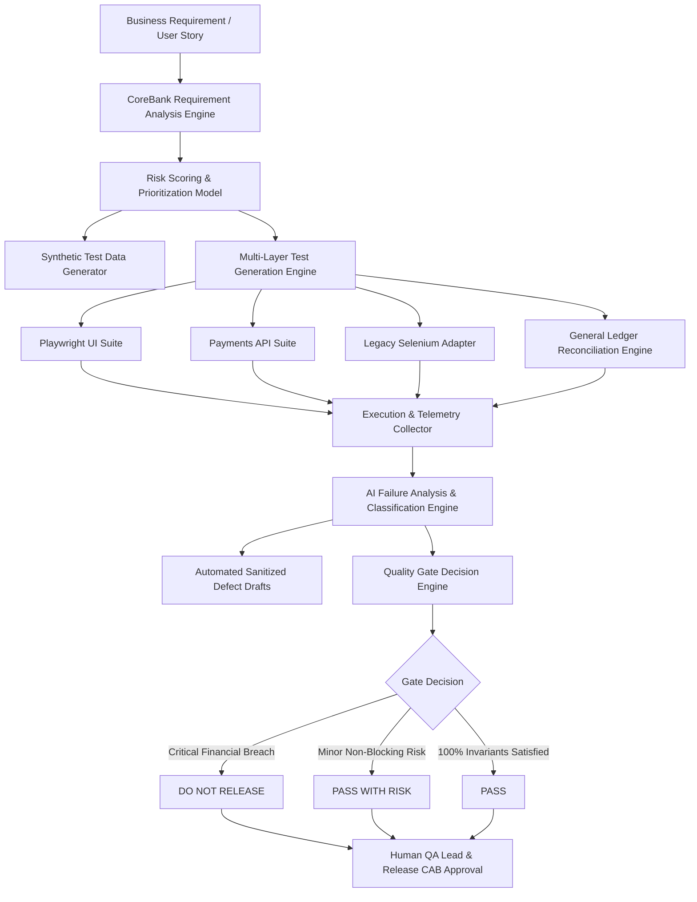

# Solution Architecture & System Design Document

## 1. System Vision & Architecture Overview
**CoreBank QA Agent** is an enterprise AI-assisted quality engineering decision-support platform designed specifically for core banking ecosystems. It transforms unstructured business requirements and ISO 20022 / Open Banking specifications into multi-layer test cases, orchestrates execution across modern (Playwright) and legacy (Selenium) interfaces, performs automated double-entry ledger reconciliation, and provides risk-weighted release recommendations.

---

## 2. Layered Architecture Components

### A. Requirement & Risk Analysis Engine
- Ingests user stories and acceptance criteria.
- Decomposes rules into boundary limits, currency precisions, session lifecycles, and saga reversals.
- Computes **Composite Risk Score (CRS)**:
$$\text{CRS} = (\text{Financial} \times 0.30) + (\text{Accounting} \times 0.20) + (\text{Security} \times 0.20) + (\text{Customer} \times 0.15) + (\text{Recovery} \times 0.15)$$

### B. Multi-Layer Test Execution Layer
1. **Modern UI Layer (Playwright TypeScript):** Handles rapid client workflows, debounce assertions, OTP/MFA forms, and trace capturing.
2. **API Verification Layer (Playwright / REST Assured):** Validates HTTP contracts, business payload status, and idempotency guarantees.
3. **Legacy UI Adapter (Selenium WebDriver):** Provides legacy browser compatibility and teller workstation automation.
4. **Financial Reconciliation Engine:** Read-only test database connector validating double-entry accounting ($Debit = Credit + Fee$) and saga compensation rollback.

### C. Failure Analysis & Safety Gating Engine
- Categorizes errors into: `PRODUCT_DEFECT_FINANCIAL`, `PRODUCT_DEFECT_SECURITY`, `PRODUCT_DEFECT_FUNCTIONAL`, `ENVIRONMENT_INFRASTRUCTURE`, or `AUTOMATION_FLAKE`.
- Zero-tolerance release blocking: If a financial or security invariant is breached, the quality gate yields **`DO NOT RELEASE`**, regardless of overall pass percentage.
