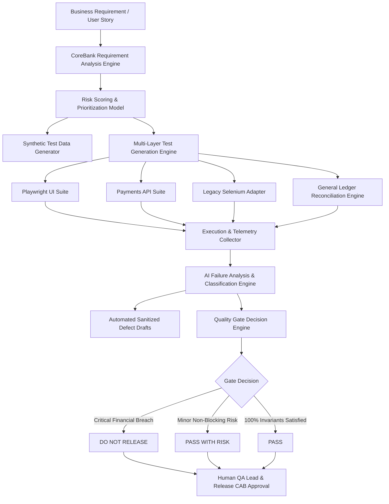

# CoreBank QA Agent: A Risk-Aware Automation Testing Framework for Core Banking Systems

### *A Proof of Concept Integrating Playwright, Selenium, API Automation, Financial Reconciliation, and CI/CD Quality Gates*

---

## Document Metadata
- **Author:** Tej Kumar Jajula
- **Document Type:** Technical White Paper
- **Version:** 1.0
- **Date:** October 5, 2026
- **Classification:** Proof of Concept
- **Status:** Ready for Submission
- **Repository Version:** v1.0.0-poc

---

## Simulation Disclaimer Notice
> **SIMULATED RESULT**  
> This result was generated for proof-of-concept demonstration.  
> It was not produced by execution against a real banking system.  
> No real financial transaction was performed.  
> No real customer data was used.  
> All US dollar amounts and account numbers are synthetic demonstration values.

---

## 1. Title Page & Document Control

| Property | Value |
|---|---|
| **Document Title** | CoreBank QA Agent: A Risk-Aware Automation Testing Framework for Core Banking Systems |
| **Subtitle** | A Proof of Concept Integrating Playwright, Selenium, API Automation, Financial Reconciliation, and CI/CD Quality Gates |
| **Author** | Tej Kumar Jajula |
| **Document Version** | 1.0 (v1.0.0-poc) |
| **Publication Date** | October 5, 2026 |
| **Target Audience** | Chief Risk Officers (CRO), Heads of Core Banking Engineering, Quality Engineering Architects, Release Managers |
| **Classification** | Technical Proof of Concept & Architecture Specification |

---

## 2. Abstract
Core banking systems require reliable validation across user interfaces, APIs, transaction-processing services, reconciliation interfaces, and accounting controls. Conventional automation frameworks reduce manual execution but often require substantial effort for test design, risk prioritization, failure analysis, traceability, and release reporting. This white paper presents CoreBank QA Agent, a risk-aware quality-engineering proof of concept that converts banking requirements into structured test scenarios, maps tests to appropriate automation channels, coordinates Playwright, Selenium, API, and reconciliation validation, and produces evidence-based quality-gate recommendations. The prototype focuses on fund transfers and demonstrates a simulated duplicate-debit condition. Although nineteen of twenty simulated tests pass, the framework produces a **`DO NOT RELEASE`** recommendation because duplicate debit is classified as a critical financial-control failure. The solution uses synthetic test data, masking, redaction, least-privilege principles, auditability, and mandatory human release approval.

---

## 3. Executive Summary
Core banking transformations face unique quality verification hurdles: high transaction criticality, complex accounting invariants, legacy-modern hybrid frontends, and catastrophic costs associated with financial errors. Traditional QA test suites execute fixed automated scripts but lack awareness of financial risk, multi-layer double-entry invariants, and compensating transaction mechanics.

CoreBank QA Agent introduces an AI-augmented decision-support framework that bridges the gap between plain-text business requirements and end-to-end ledger verification. In a simulated trial of a domestic fund-transfer journey (`REQ-PAY-FT-001`), the framework synthesized 20 risk-ranked test cases spanning Playwright UI, REST API contracts, and General Ledger reconciliation. Under a simulated 80ms concurrency race condition, the agent detected an un-reconciled duplicate debit (-$250.00 USD variance), generated a sanitized defect report (`DEF-FT-2026-001`), and enforced a **`DO NOT RELEASE`** quality gate despite an overall 95.0% pass rate.

The solution maintains strict governance boundaries: it operates exclusively on synthetic data, enforces full PII masking (`XXXXXXXX1234`) and credential redaction (`[REDACTED]`), and preserves human authorization as the mandatory final release control.

---

## 4. Introduction & Industry Context
Core banking platforms form the backbone of modern financial institutions, managing customer accounts, wire transfers, automated clearing house (ACH) payments, deposits, loans, and real-time ledger accounting. In recent years, banks have accelerated digital modernization initiatives, decoupling legacy mainframes into distributed microservices and customer-facing web/mobile applications.

However, this transition introduces architectural fragility. Financial transactions cross multiple distributed boundaries: from single-page web applications to API gateways, message brokers (Kafka/MQ), payment orchestrators, and core General Ledger databases. In this environment, an HTTP 200 response from a payment API endpoint provides zero guarantee that downstream ledger entries balanced atomically or that customer balances were debited correctly.

---

## 5. Core Banking Testing Challenges
Quality engineering in core banking encounters four systemic challenges:

1. **The "HTTP 200 Fallacy":** Payment gateways frequently return HTTP 200 OK upon queuing a payment request. If downstream clearing fails or executes twice, the API client remains unaware of the financial discrepancy.
2. **Multi-Layer Architectural Divergence:** Institutions operate modern customer-facing SPAs alongside legacy internal teller and administrative portals (often requiring IE compatibility mode or legacy Selenium automation).
3. **Complex Accounting & Double-Entry Invariants:** Financial transactions must adhere strictly to double-entry bookkeeping ($Debits = Credits + Fees$). Standard automation frameworks cannot inspect or reconcile ledger journals.
4. **Regulatory & Privacy Mandates:** Strict regulatory standards (PCI-DSS, SOC2, FFIEC, GDPR) strictly forbid using real customer data, unmasked account numbers, or live credentials in test automation environments.

---

## 6. Problem Statement
Traditional test automation frameworks (such as standalone Selenium or Cypress scripts) execute pre-scripted assertions against DOM elements or HTTP status codes. They do not:
- Analyze unstructured banking user stories for boundary ambiguities.
- Prioritize test execution dynamically based on financial and regulatory risk.
- Validate double-entry accounting balances post-transaction.
- Correlate UI debounce failures with backend race conditions.
- Prevent release pipeline approval when a high gross pass rate masks a critical financial defect.

---

## 7. Objectives of CoreBank QA Agent
The CoreBank QA Agent was developed to achieve five primary objectives:
1. **Automated Requirements-to-Test Synthesis:** Ingest natural-language user stories and generate structured, risk-ranked test cases mapped 100% to acceptance criteria.
2. **Multi-Channel Test Orchestration:** Coordinate test execution across modern Playwright UI, legacy Selenium adapters, and REST API contract suites.
3. **Automated Double-Entry Reconciliation:** Audit pre- and post-transaction account balance snapshots and General Ledger journals via read-only interfaces.
4. **Intelligent Root-Cause Triage:** Categorize execution failures into financial, security, functional, or environmental defects and draft sanitized defect reports.
5. **Risk-Weighted Release Gating:** Implement CI/CD quality-gate logic where financial and ledger invariants are non-negotiable release blockers.

---

## 8. Scope, Assumptions & Safety Boundaries
- **Proof-of-Concept Scope:** Focuses specifically on the domestic fund-transfer journey to a registered beneficiary (`REQ-PAY-FT-001`).
- **Synthetic Data Isolation:** 100% synthetic test data (`CUST-9921`, `ACCT-CHK-001`). Zero access to real customer accounts or production systems.
- **Single-Currency Domestic Transfers:** Models domestic USD transfers without foreign exchange (FX) conversion.
- **Decision-Support Boundary:** CoreBank QA Agent provides evidence-based recommendations; it **NEVER** autonomously approves production deployments or commits live financial transactions.
- **Simulated Demonstration:** Results and telemetry reflect deterministic simulation harnesses designed for architectural evaluation.

---

## 9. Proposed CoreBank QA Agent Framework
The CoreBank QA Agent functions as an intelligent decision-support copilot embedded within the software delivery lifecycle.

---

## 10. Solution Architecture
The architecture consists of four modular tiers:
1. **Specification & Ingestion Tier:** Decomposes user stories into formal acceptance criteria, extracts business rules, and flags unstated ambiguities.
2. **Multi-Channel Automation Tier:** Executes UI workflows via Playwright TypeScript, validates API schemas via AJV/REST clients, and bridges legacy workflows via the Selenium Banking Adapter.
3. **Reconciliation & Invariant Tier:** Evaluates double-entry accounting integrity, detects duplicate postings, and validates saga rollback completeness.
4. **Governance & Quality Gate Tier:** Evaluates composite test results against risk policies and emits release recommendations.

*(Reference: [`docs/architecture.md`](docs/architecture.md))*

---

## 11. Agent Workflow
The operational workflow proceeds through six distinct stages:
1. **Ingest Requirement:** Ingest plain-text requirements and extract entities, roles, and constraints.
2. **Ambiguity Triage:** Flag missing edge cases (e.g., daily limit aggregation rules).
3. **Risk Scoring:** Calculate Composite Risk Scores for each generated scenario.
4. **Multi-Layer Dispatch:** Execute Playwright, API, and reconciliation test fixtures.
5. **Reconciliation Audit:** Verify balance deltas and journal entries.
6. **Decision Formulation:** Output release recommendations (`PASS`, `PASS WITH RISK`, `DO NOT RELEASE`, `INCONCLUSIVE`) to CI/CD pipelines.

---

## 12. Risk-Scoring Model
The framework employs a deterministic 5-factor mathematical weighting algorithm:
$$\text{Composite Risk Score (CRS)} = (F \times 0.30) + (A \times 0.20) + (S \times 0.20) + (C \times 0.15) + (R \times 0.15)$$

Where:
- $F =$ Financial Impact (Direct monetary discrepancy, duplicate debits)
- $A =$ Accounting / Ledger Impact (GL out-of-balance, un-reconciled postings)
- $S =$ Security & Regulatory Impact (Token bypass, unmasked PII, AML/KYC evasion)
- $C =$ Customer Impact (Account lockout, false debit notices)
- $R =$ Recovery Complexity (Manual ledger adjustment vs. automated saga rollback)

### Table 1: Risk Classification Boundaries

| Risk Category | Score Range | Release Blocking? | Resolution SLA |
|---|---|---|---|
| **CRITICAL** | $8.0 - 10.0$ | **Yes (Mandatory Block)** | 24 Hours |
| **HIGH** | $6.0 - 7.9$ | **Yes (Mandatory Block)** | 72 Hours |
| **MEDIUM** | $4.0 - 5.9$ | No (Advisory / Workaround) | 7 Days |
| **LOW** | $1.0 - 3.9$ | No (Cosmetic / Informational) | 14 Days |

*(Reference: [`config/risk-rules.json`](config/risk-rules.json))*

---

## 13. Test-Generation Approach
The agent generates structured test specifications across four key banking test domains:
- **Happy Path / E2E:** Full customer transfer within limits (`TC-FT-001`).
- **Financial Guardrails:** Insufficient funds (`TC-FT-002`), daily cumulative limit boundaries (`TC-FT-003`), inactive beneficiaries (`TC-FT-004`).
- **Concurrency & Idempotency:** Rapid multi-click UI debounce (`TC-FT-008`), identical idempotency key replay (`TC-FT-009`), parallel balance depletion race conditions (`TC-FT-010`).
- **Resilience & Saga Compensation:** Downstream credit timeouts (`TC-FT-013`), automated reversal verification (`TC-FT-014`), unrecoverable suspense queue routing (`TC-FT-015`).

*(Reference: [`tests/fund-transfer-test-catalog.md`](tests/fund-transfer-test-catalog.md))*

---

## 14. Playwright UI Automation
Modern customer web workflows are automated using Playwright TypeScript with the Page Object Model pattern ([`pages/FundTransferPage.ts`](pages/FundTransferPage.ts)). Stable locators (`getByRole`, `getByTestId`) eliminate selector flakiness.

Key validation: **`TC-FT-008` (UI Debounce Verification)** ensures that rapid successive clicks on the transfer confirmation button immediately disable the element, preventing duplicate HTTP requests from client-side double submissions.

---

## 15. Selenium Legacy Support
To support legacy core banking teller applications, the framework provides an isolated adapter ([`tests/legacy-ui/selenium/SeleniumBankingAdapter.ts`](tests/legacy-ui/selenium/SeleniumBankingAdapter.ts)). The adapter encapsulates WebDriver lifecycle management, utilizes explicit element waits, and sanitizes failure screenshots without adding heavy compile-time dependencies to the modern test runner.

---

## 16. API Automation & Contract Verification
The API suite ([`tests/api/fund-transfer-api.spec.ts`](tests/api/fund-transfer-api.spec.ts)) validates REST payment contracts against Draft-07 JSON Schema specifications ([`schemas/transfer-api-schema.json`](schemas/transfer-api-schema.json)). 

Key validation: **`TC-FT-009` (Idempotency Replay)** verifies that sending an identical `X-Idempotency-Key` returns the original transaction reference without creating a second ledger posting.

---

## 17. Financial Reconciliation Engine
The reconciliation engine ([`tests/reconciliation/CoreBankReconciliationEngine.ts`](tests/reconciliation/CoreBankReconciliationEngine.ts)) acts as an independent auditor evaluating double-entry bookkeeping invariants:
$$\Delta \text{Source Balance} = \Delta \text{Beneficiary Balance} + \text{Transaction Fee}$$
$$\text{Net Variance} = (\Delta \text{Source} - \Delta \text{Beneficiary}) - \text{Fee} = 0.00$$

If Net Variance $\ne 0.00$, the engine raises a critical accounting discrepancy flag.

---

## 18. CI/CD Integration (GitHub Actions Primary, Azure DevOps Reference)
Continuous quality governance is orchestrated primarily through GitHub Actions ([`.github/workflows/corebank-qa-agent.yml`](.github/workflows/corebank-qa-agent.yml)), with the multi-stage Azure DevOps pipeline ([`pipelines/azure-pipelines.yml`](pipelines/azure-pipelines.yml)) maintained as an optional legacy reference.

The primary GitHub Actions workflow structure includes:
1. **Framework Validation Job (`validate-framework`):** Checks out the codebase on `ubuntu-latest`, configures Node.js (Active LTS 22), runs `npm ci`, and executes TypeScript compilation (`npm run typecheck`) and the full validation test suite (`npm run validate`).
2. **Client Data Evaluation Job (`evaluate-client-data`):** Validates input file safety under `input/`, invokes the single-command QA Agent (`npm run agent -- --input <file>`), maps agent exit codes, writes markdown job summaries to `$GITHUB_STEP_SUMMARY`, and uploads sanitized results via `actions/upload-artifact@v4`.
3. **Quality-Gate Policy Enforcement:** Enforces blocking gates (exit code 3 fails the workflow on `DO NOT RELEASE` or `INPUT_REJECTED`) only after complete evidence upload.
4. **Protected Human Review Job (`human-review-gate`):** Routes `PASS_WITH_RISK` outcomes to the protected `corebank-human-review` GitHub Environment for authorized human review before progression.

---

## 19. Failure Classification Engine
Failures are deterministically classified using the taxonomy defined in [`prompts/failure-analysis-prompt.md`](prompts/failure-analysis-prompt.md):
- `PRODUCT_DEFECT_FINANCIAL` (Critical - Duplicate debit, ledger imbalance)
- `PRODUCT_DEFECT_SECURITY` (Critical - Unmasked PII, token bypass)
- `PRODUCT_DEFECT_FUNCTIONAL` (High/Medium - UI validation error)
- `ENVIRONMENT_INFRASTRUCTURE` (504 Gateway Timeout, connection refusal)
- `AUTOMATION_SCRIPT_FLAKE` (DOM selector timing issue)

---

## 20. Defect Reporting
When a critical failure occurs, the agent formats a structured defect report containing reproduction steps, expected vs. actual balance deltas, and sanitized telemetry.

*(Reference: [`reports/defect-DEF-FT-2026-001.md`](reports/defect-DEF-FT-2026-001.md))*

---

## 21. Quality-Gate Evaluation Engine
The Quality Gate Engine ([`scripts/evaluate-quality-gate.ts`](scripts/evaluate-quality-gate.ts)) evaluates multi-layer results against policy invariants:
- **`PASS`:** 100% of critical and high-risk tests pass; ledger balanced.
- **`PASS WITH RISK`:** Only approved medium/low non-financial tests fail with documented workarounds.
- **`DO NOT RELEASE`:** Any duplicate debit, ledger imbalance, PII leak, or failed reversal detected.
- **`INCONCLUSIVE`:** Test environment or reconciliation audit stream unavailable.

---

## 22. Security, Privacy, and Governance Controls
1. **PII Masking:** Account numbers masked as `XXXXXXXX1234`.
2. **Secret Redaction:** Bearer JWT tokens and passwords redacted as `[REDACTED]`.
3. **Zero Production Data:** Evaluated exclusively on synthetic datasets.
4. **Least-Privilege Database Access:** Read-only replica access for reconciliation auditing.
5. **Human Control:** The agent cannot autonomously approve releases.

*(Reference: [`docs/governance.md`](docs/governance.md), [`docs/security-validation-report.md`](docs/security-validation-report.md))*

---

## 23. Fund-Transfer Proof of Concept Demonstration
The proof-of-concept journey (`REQ-PAY-FT-001`) was evaluated against 20 structured scenarios. All 12 business acceptance criteria achieved 100% mapping in the Requirements Traceability Matrix ([`docs/traceability-matrix.md`](docs/traceability-matrix.md)).

---

## 24. Simulated Duplicate-Debit Scenario
To evaluate release-blocking controls, an 80ms concurrency race condition was simulated (`TC-FT-009`):
- **Scenario:** Customer initiated a $250.00 transfer (`TXN-20260510-984372`). A duplicate API call was dispatched with the identical `X-Idempotency-Key`.
- **Observed Failure:** The mock backend failed to acquire a distributed lock, executing two separate debits ($250.00 + $250.00 = $500.00 total) against a single $250.00 credit.
- **Ledger Impact:** Net financial variance of -$250.00 USD.
- **Quality Gate Outcome:** Evaluated to **`DO NOT RELEASE`** and logged defect `DEF-FT-2026-001`.

---

## 25. Results and Observations

### Actual Validation Results (Verified in Workspace)
- **TypeScript Strict Compilation:** 0 errors (Exit code 0).
- **Reconciliation Engine Unit Harness:** 7 of 7 fixtures passed.
- **Quality Gate Evaluator Matrix:** 9 of 9 decision test cases passed.
- **Independent Consistency Checks:** 15 of 15 checks passed.
- **Acceptance Criteria Coverage:** 12 / 12 (100.0%).
- **Structured Test Catalog:** 20 test specifications.
- **Discovered Playwright Tests:** 7 executable specs across UI and API.
- **Plaintext Secrets Detected:** 0.
- **Unmasked PII Records Detected:** 0.

### Simulated Demonstration Results (Synthetic Environment)
- **Total Simulated Tests:** 20
- **Passed Tests:** 19 (95.0%)
- **Failed Tests:** 1 (`TC-FT-009` Duplicate Debit)
- **Final Quality Gate Decision:** **`DO NOT RELEASE`**
- **Observation:** A traditional 95% pass-rate gate would have released this build. CoreBank QA Agent blocked the deployment due to financial invariant failure.

### Not Executed (Transparently Disclosed)
- Real banking UI execution against live banking portals.
- Real banking API calls to live payment switches.
- Direct live production database transactions.
- Multi-currency / FX conversions.

### Proposed Future Targets (Not Measured)
- 40% reduction in test design and cataloging time.
- 60% reduction in defect report preparation and telemetry gathering duration.
- 50% improvement in critical-path financial scenario coverage.

---

## 26. Limitations
1. Evaluated against synthetic mock harnesses rather than physical mainframe connections.
2. Models domestic single-currency transfers (USD).
3. Saga reversal verification simulated under local network delay fixtures.

---

## 27. Future Roadmap
1. **Phase 2:** Multi-currency FX and ISO 20022 cross-border payment message validation.
2. **Phase 3:** Automated interest accrual and loan amortization schedule reconciliation.
3. **Phase 4:** High-volume End-of-Day (EOD) batch GL posting verification.

---

## 28. Conclusion
The CoreBank QA Agent demonstrates that AI-assisted quality engineering, when combined with multi-layer test execution, double-entry ledger reconciliation, and strict risk gating, effectively mitigates financial risk in core banking systems. By treating financial invariants as zero-tolerance release blockers, institutions can maintain regulatory compliance and accounting integrity while accelerating release cycles.

---

## 29. References
1. Federal Financial Institutions Examination Council (FFIEC): *Information Technology Examination Handbook: Architecture, Infrastructure, and Operations*.
2. Payment Card Industry Security Standards Council: *PCI-DSS v4.0 Requirements*.
3. Martin Fowler: *Patterns of Enterprise Application Architecture & Saga Distributed Transactions*.
4. Basel Committee on Banking Supervision: *Sound Practices for the Management and Supervision of Operational Risk*.

---

## 30. Appendices
- **Appendix A:** Complete Requirements Traceability Matrix ([`docs/traceability-matrix.md`](docs/traceability-matrix.md))
- **Appendix B:** Sample Critical Defect Report ([`reports/defect-DEF-FT-2026-001.md`](reports/defect-DEF-FT-2026-001.md))
- **Appendix C:** Machine-Readable Quality Gate Artifact ([`evidence/quality-gate-result.json`](evidence/quality-gate-result.json))
- **Appendix D:** Independent Validation Report ([`evidence/final-independent-validation.md`](evidence/final-independent-validation.md))
- **Appendix E:** Submission Manifest ([`evidence/submission-manifest.md`](evidence/submission-manifest.md))
